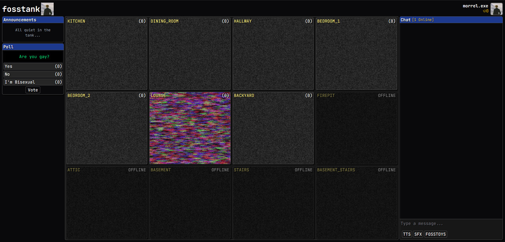

# Fosstank

Free and open source 24/7 streaming server inspired by [fishtank.live](https://fishtank.live)



## Features

- **24/7 Live Streaming**: Continuous HLS streaming using ffmpeg
- **Multi-Camera Support**: Read from multiple local RTSP streams (e.g. PoE cameras)
- **Real-time Chat**: SSE-based live messaging system
- **User Authentication**: Account creation and management system
- **Interactive Orders**:
  - Text-to-Speech (TTS) integration
  - Sound effects (SFX) playback
  - Custom "Fosstoy" interactive elements
- **Community Features**:
  - Live polls and voting system
  - Public announcements
  - Season and participant management
- **Monetization System**:
  - Token-based economy
  - Token bundle purchases
  - Stripe payment integration
- **Media Management**:
  - Automatic stream transcoding
  - S3-compatible storage integration
- **Administrative Tools**:
  - Pocketbase admin dashboard
  - Content moderation capabilities (WIP)
- **Developer-Friendly**:
  - Docker-based deployment
  - Open source and self-hostable

## Architecture

The project consists of two main services:

### Origin Server (`origin/`)
The origin server handles transcoding and order fulfilment.
It is intended to be hosted on an on-site server.

**Features:**
- Reads from local RTSP streams (e.g., PoE cameras)
- Converts streams to 1080p HLS using FFmpeg
- Fulfills TTS, SFX, and Fosstoy orders (WIP)

**Directory Structure:**
- `main.go` - Start encoders, register routes, and start HTTP server.
- `handlers.go` - Handlers for HTTP endpoints.
- `streams.go` - Struct and affiliated methods for handling stream configurations.
- `upload.go` - Handles syncing transcoding artifacts to S3.
- `encoding.go` - Contains ffmpeg configurations and code to start ffmpeg subprocesses.

### Uplink Server (`uplink/`)
The uplink server serves the ui to users and handles all user interaction accordingly. Any TTS, SFX, Fosstoy orders are propagated to the origin server for fulfillment. 

**Features:**
- User authentication and accounts
- Live chat and messaging
- Text-to-Speech (TTS) orders
- Sound effects (SFX) orders
- Fosstoys (interactive elements)
- Polls and voting system
- Announcements
- Token bundles and monetization
- Stripe integration for payments
- Season/participant management

**Directory Structure:**
- `main.go` - Pocketbase server with custom hooks, routes, etc.
- `stripe.go` - Payment processing.
- `migrations/` - Database schema migrations.
- `ui/` - Next.js frontend application.
  - `src/app/` - Next.js app router pages.
  - `src/components/` - React components.
  - `src/lib/` - Utility libraries.

## Building

Build all Docker images:
```bash
make build
# or
docker buildx bake
```

Start all services:
```bash
docker compose up -d
```

After starting:
- **Origin Server**: http://localhost:8090
- **Uplink Server**: http://localhost:8091  
- **Uplink Server Admin UI (Pocketbase)**: http://localhost:8091/_/
- **MinIO Admin UI**: http://localhost:9001

## Running Without Docker

If you prefer to run the services directly without Docker:

### Prerequisites
- Go 1.25+ 
- Node.js 20+ and npm
- FFmpeg (for the origin server)

### Origin Server
```bash
cd origin
go run .
```

### Uplink Server
```bash
# Terminal 1: Start the backend
cd uplink
go run . --http=127.0.0.1:8091

# Terminal 2: Start the frontend (development)
cd uplink/ui
npm install
npm run dev
```